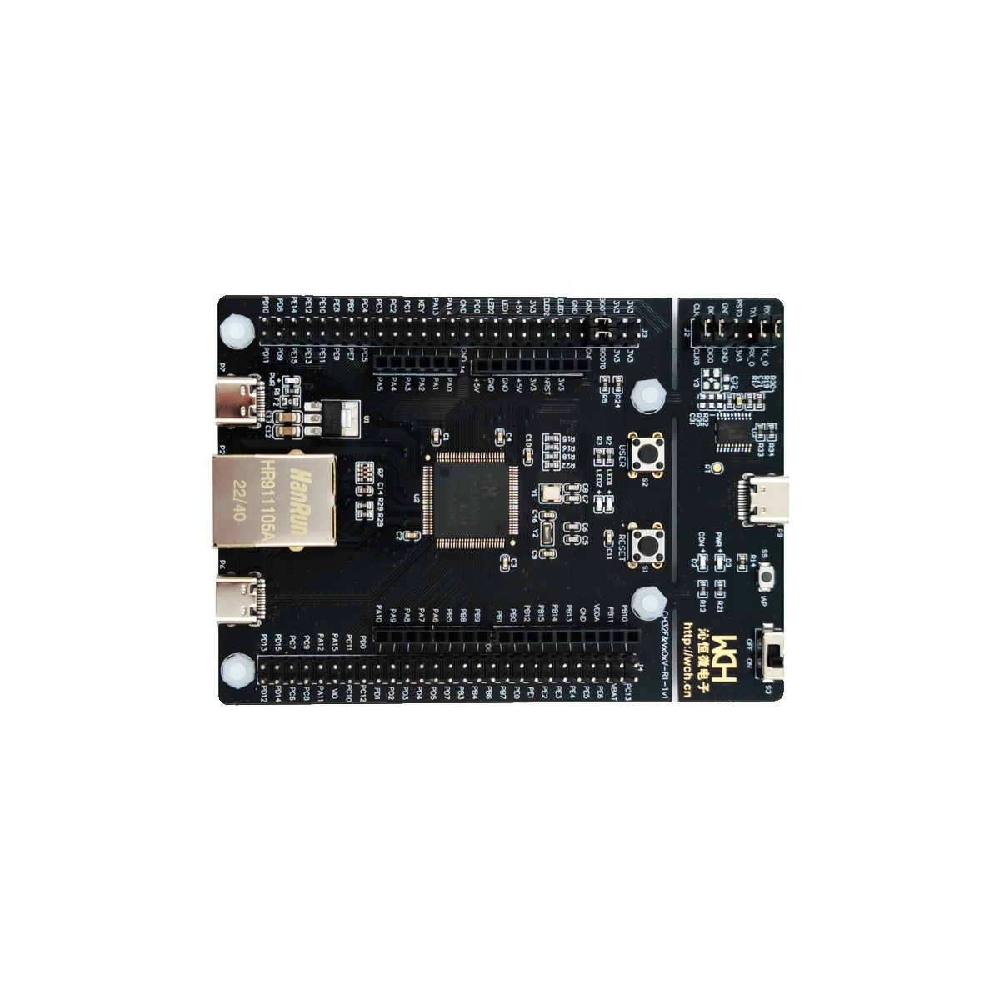
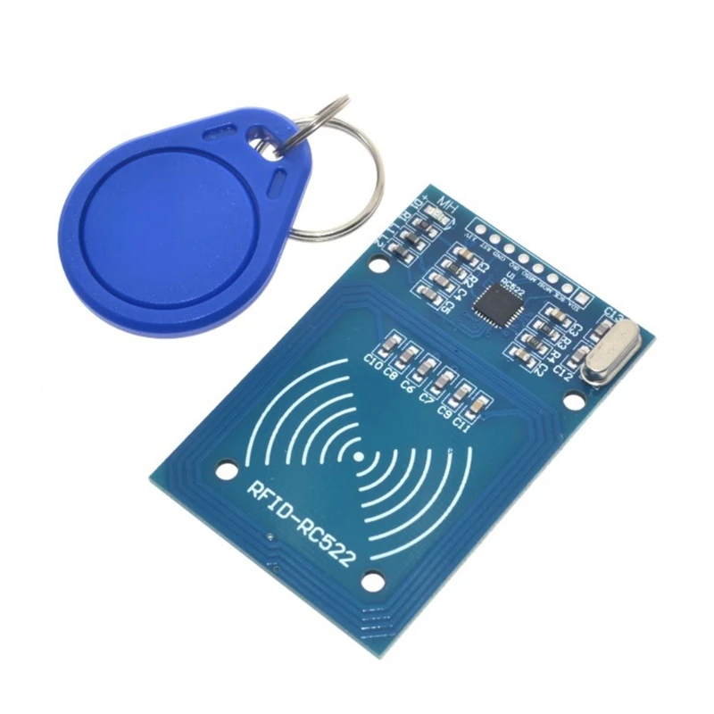
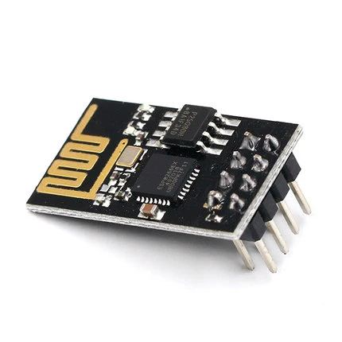
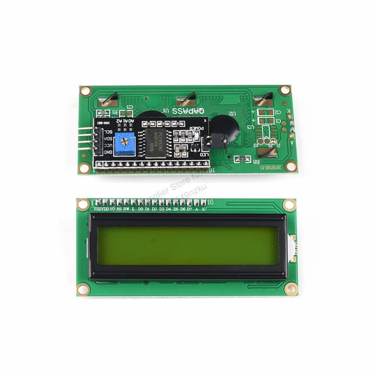
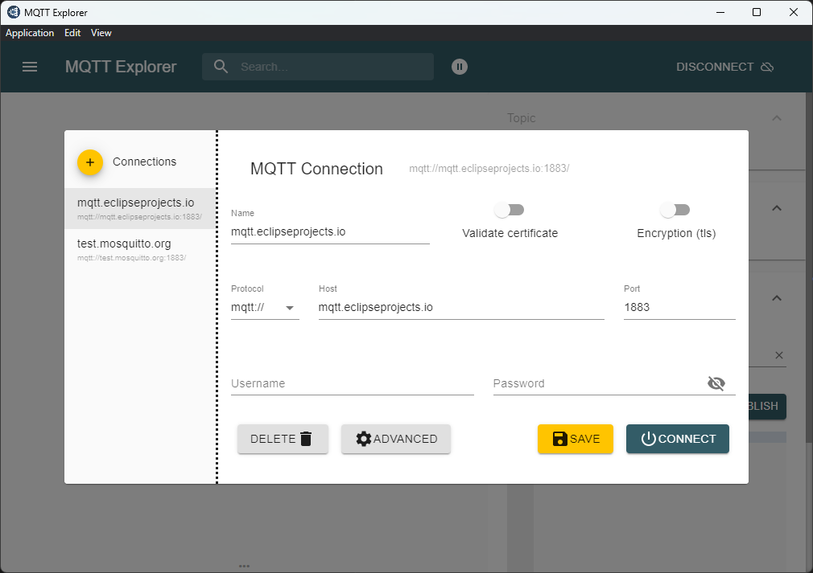
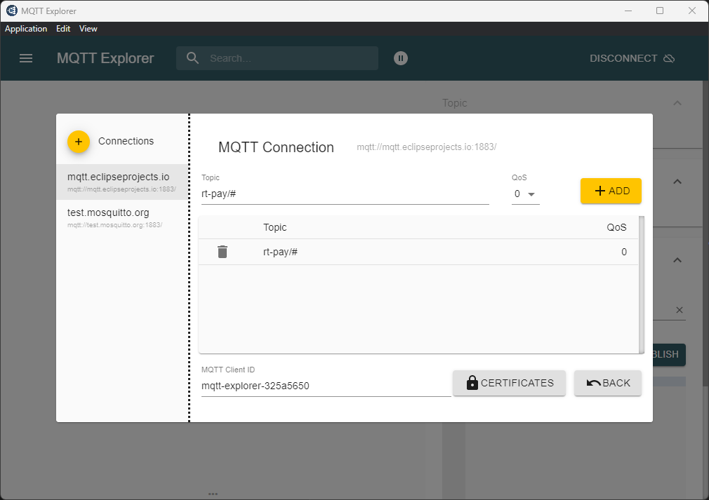
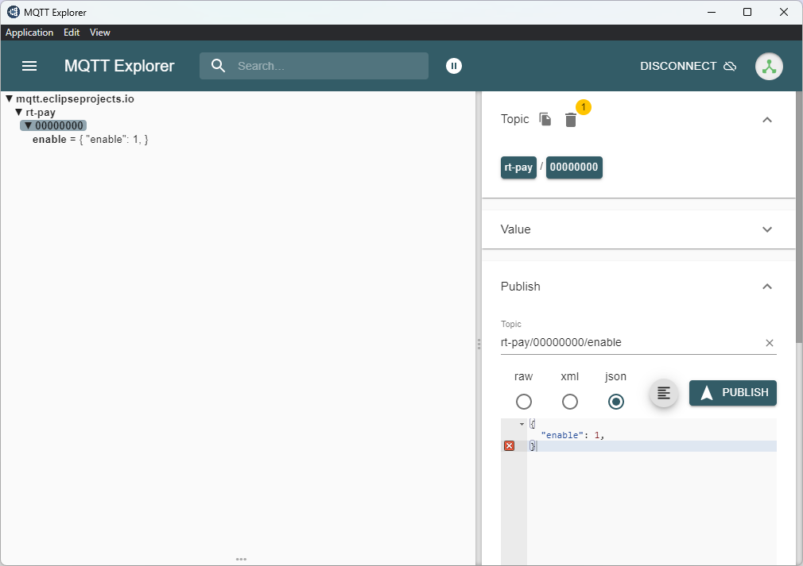
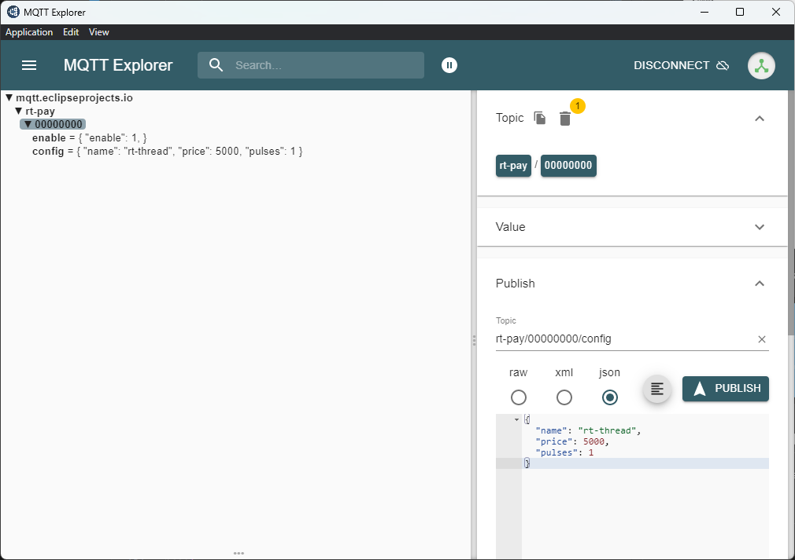
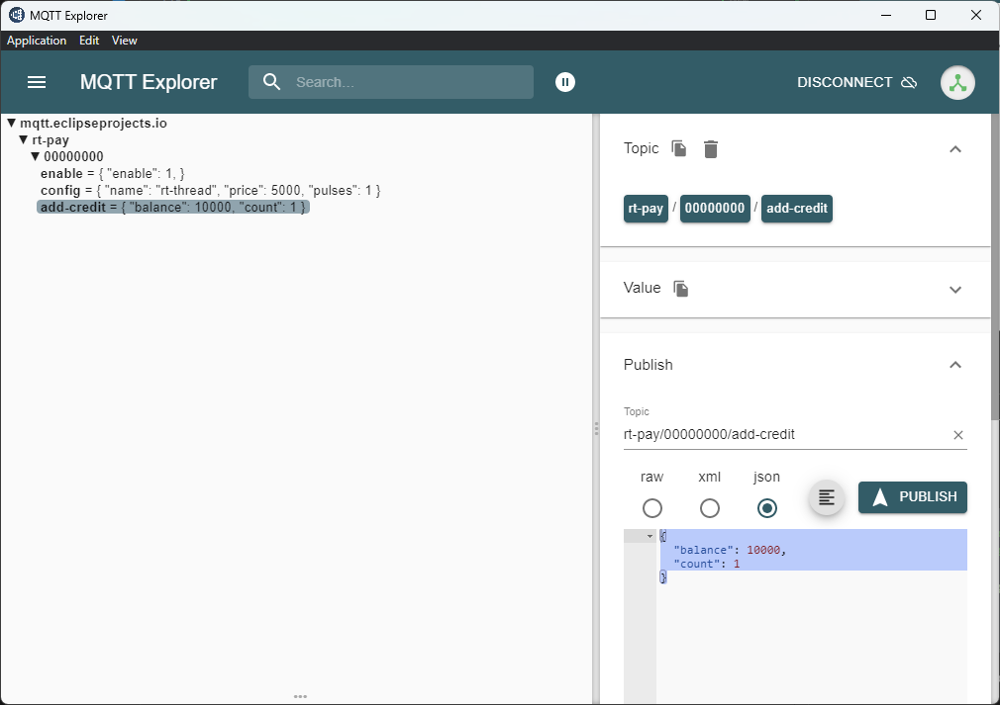
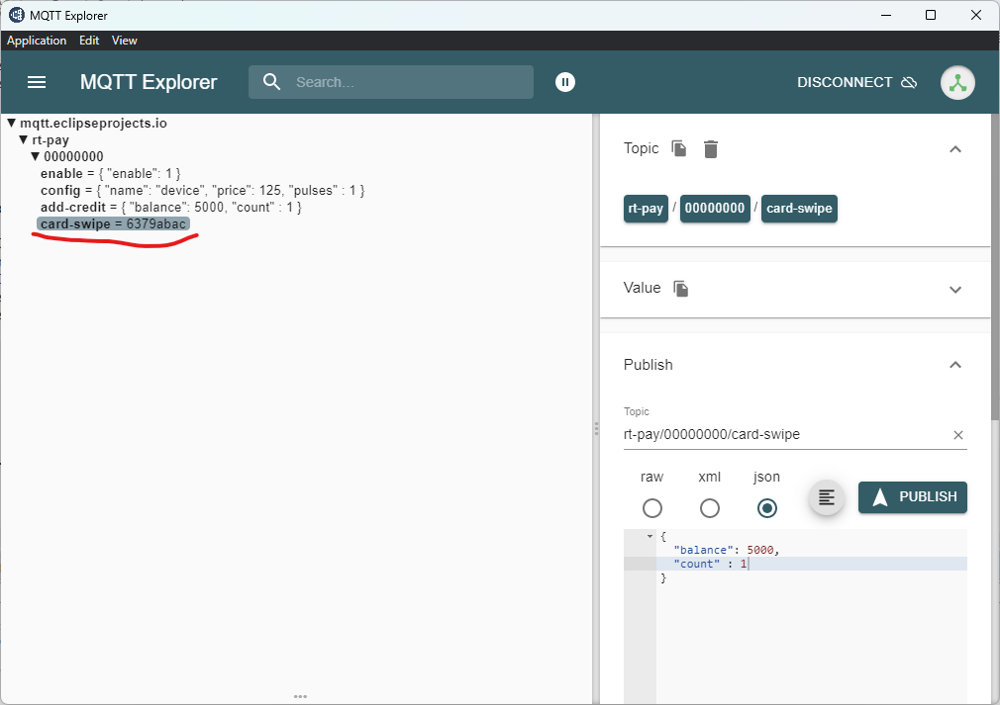

# rt-pay
rt-thread based wireless payment solution

# Introduction
rt-pay is a wireless payment device mainly focused on arcade machines.

It's designed to run on a ch32v308 RISC-V microcontroller but could be easily ported to any device supported by rt-thread OS.
For a morte thechnical description you can take a look at [docs](docs/).

# What's different from others devices?

rt-pay have couple of outsanding features:

- code is based on [RT-Thread](https://github.com/RT-Thread/rt-thread), this means you can use this as a starting point and extend it easily.
- support for mcfr522 card readers.
- support for esp-01s as internet connection layer.
- mqtt based communication.

# Why using RT-Thread?
From [RT-Thread](https://www.rt-thread.io/)'s website.

> RT-Thread born in 2006, it's an open-source, neutral, and community-based real-time operating system (RTOS). The software has the characteristics of very low resource occupancy, high reliability, high scalability, can be greatly used in sensing nodes, wireless connection chips and many resource-constrained scenes, also widely applied in gateway, IPC, smart speakers, and many other high-performance applications.

This may sound as a generic RTOS project description, and probably any other text here will sound the same so let's shorten it a bit going directly to pros and cons.

| pros |
|------|
|Easy to learn if you come from other RTOS or Embedded linux|
|Good abstraction layers, write extensible code from day 1|
|Scons based build system|
|Fair ammount of supported devices|
|Support multiple architectures|
|Support multimple compilers|
|Arduino compatibility layer|
|A packages system to install 3rd party modules|

|cons|
|----|
|Official IDE still in early faces, lot of issues|
|Lack of support for thread-awareness debugging|
|Packages documents are mostly in chinesse|
|Official IDE is only for windows|
|Build system and tools might be overwhelming for the less seasoned users|

# Why using MQTT?
MQTT is a lightweight, easy to extend, easy to escalate communication protocol with a lot of ready to use solutions in the market; this is pretty much the standar for iot devices and saves a lot of time and effort writing the server side code.

# Required components
- ch32v307v development board



- RFID-RC522 arduino module



- ESP-01S wifi module



- I2C lcd interface + 16x2 display



# Wiring the Componets

|RFID-RC522|Dev Board|
|--------|---------|
|SDA/CS  | PE6 |
|SCK     | PE5 |
|MOSI    | PE4 |
|MISO    | PE3 |
|IRQ     | NC  |
|GND     | GND |
|RST     | PE2 |
|3.3v    | 3.3v|

|ESP-01S|Dev Board|
|-------|---------|
|GND    | GND |
|3.3v   | 3.3v|
|RX     | PA3 |
|TX     | PA2 |

|I2C LCD|dev Board|
|-------|---------|
|VCC    | 5.0v|
|GND    | GND|
|SDA    | PB9|
|SDC    | PB8|

# How to build
Building is a simple as cloning the repo and importing the project in RT-Thread Studio.

But before doing that you migth want to update some definitions:

|define|comment|example|
|------|-------|-------|
|ESP8266_SAMPLE_WIFI_SSID|SSID to connect|"WiFiName"|
|ESP8266_SAMPLE_WIFI_PASSWORD|WiFi's password| "WiFiPass"|
|MQTT_BROKER_URI|mqtt broker uri| "tcp://mqtt.eclipseprojects.io:1883"|
|DEVICE_UUID|the uuid of the device|"00000000"|

## Don't want or can't use the RT-Thread Studio ?
 No worries, just run
 >scons --exec-path="WCH_RISCV_TOOLCHAN_PATH\bin"
# Testing the software

## Setup the mqtt client

Before having some fun we still need to setup the broker; while you're free to use any client of you're preference I'm using [MQTTExplorer](http://mqtt-explorer.com/) to provide some extra guidance for starters.

### Configure the connection

Make sure you're connecting to the same broker specified by MQTT_BROKER_URI



### Subscribe to topics of interest

This project uses "rt-pay" as root level so subscribing to "rt-pay/#"  will do the work.



## MQTT Topics
For this version all topics will follow the same convention:

>rt-pay/device-uid/topic

Unless stated otherwise all payload data is a json object
### rt-pay/UID/enable
This topic is used to enable or disable the device

The accepted parameters for this message are:
|name|type|description|
|----|----|-----------|
|enable|int|0 -> disable, 1 -> enable|

example
```json
{
  "enable": 1
}
```

### rt-pay/UID/config
This topic is used to update configuration on the device

The accepted parameters for this message are:
|name|type|description|
|----|----|-----------|
|name|string|16 byte name of device|
|price|int| the price per credit in cents|
|pulses|int| the total of pulses per credit|

example
```json
{
  "name": "rt-thread",
  "price": 500,
  "pulses": 1
}
```

### rt-pay/UID/add-credit
This topic will make the device to add credits to the arcade machine

The accepted parameters for this message are:
|name|type|description|
|----|----|-----------|
|balance|int|the balance of the source account in cents|
|count|int|the total of credits to add|


example
```json
{
  "balance": 5000,
  "count": 1
}
```
### rt-pay/UID/card-swipe
This is a raw message used to inform of a card swipe in the device.

The content of the message is a string containing the hex representation of the card uid.

## Enabling the device
If everything is working correctly you should be able a message like this one:


This means the device is running and connected with the broker, in order to enable the device you should send an enable message to the device

example:
```json
// make sure to change the the UUID of the device
// topic rt-pay/00000000/enable -> UUID of device is 00000000
{
  "enable": 1
}
```

If you're using mqtt explorer:



After receiving the message you should be able to see this message:


## Configurating the device
You can change some settings of the device by sending the configuration msg.

Changes are applied inmediatly after being received, if the device is enabled you should be able to see how the price is updated.

example:
```json
// make sure to change the the UUID of the device
// topic rt-pay/00000000/config -> UUID of device is 00000000
{
  "name": "rt-thread",
  "price": 5000,
  "pulses": 1
}
```

If you're using mqtt explorer:



## Adding credits to the arcade machine
You can add credits to the arcade machine connected to the device by sending the add-credit message.

example:
```json
// make sure to change the the UUID of the device
// topic rt-pay/00000000/add-credit -> UUID of device is 00000000
{
  "balance": 10000,
  "count": 1
}
```

If you're using mqttexplorer:



After adding credit you should be able a message like this one:


## Scan a card
If you scan a card using the rfid reader a message will be sent to the broker under the topic /rt-pay/UID/card-swipe

If you're using mqttexplorer you should be able to see the uid of the card in the payload of the msg



# What's next

This device is still a WIP and have a few tasks to do:

* Add authentication to avoid a 3rd party to inject messages.
* Add OTA updates
* Add auto generated UIDs (build or runtime)
* Add menu screen to show the UUID
* Configure the device via usb
* Download stats of the device via usb
* Add topics for stats
* Add serialized ids for topic messages to avoid processing a message twice (this will make easier to implement with services that don't support QoS2 like azure or awx)

